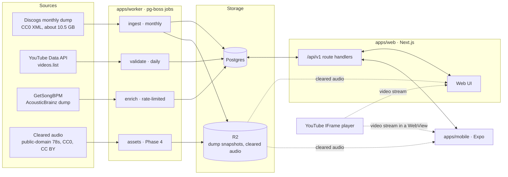

# Crate-Digging App — Build Spec for Claude Code

Oct 3, 2026 · @Christopher Lee

Save this as `docs/SPEC.md` in the repo and point Claude Code at it. It defines what to build, the rules the build must never break, and the order to build it in, phase by phase with gates.

## How to use this spec

Claude Code builds this one phase at a time, starting with Phase 0, and stops at each gate for the owner's go-ahead. Where this spec and the earlier architecture doc differ, this spec wins.

**Set up the repo**

1. Export this doc to Markdown and save it as `docs/SPEC.md`.
2. Create `CLAUDE.md` at the repo root with the product summary, commands and conventions, kept under 200 lines. Claude Code loads it at the start of every session ([docs](https://code.claude.com/docs/en/memory)). Mention `docs/SPEC.md` in backticks rather than importing it with `@`, since an import would load the whole spec into every session.
3. Copy "Non-negotiable rules" into `.claude/rules/compliance.md` with no `paths` field, so it loads in every session.
4. CLAUDE.md is context, not enforcement. Add the compliance tests from "Engineering conventions" to CI as well.

**Working agreement**

- Read the current phase's tasks before starting, and propose a plan before writing code.
- Build only the current phase. At its gate, stop and report the results.
- If a task seems to require breaking a non-negotiable rule, stop and ask. Never work around one.
- Record any decision that changes this spec in `docs/DECISIONS.md`, one numbered entry each.
- Keep `pnpm verify` green on every commit.
- Don't copy code from Digga (`github.com/razorjack/digga`). It has no license; its ideas are described here.

**Starter prompt**

```text
Read CLAUDE.md, .claude/rules/compliance.md and docs/SPEC.md. We're starting Phase 0.
Propose a plan for scaffolding the monorepo and the catalog:count command,
then wait for my go-ahead before writing code.
```

## Product scope

A web and mobile app for digging through records at random: Discogs data decides what plays, and YouTube's player plays it. The working name is undecided ("Sampl" is taken), so code uses an `APP_NAME` constant and the `@app/*` package scope.

The core loop: set filters, shuffle, listen, then save the record to a crate or skip it.

- **YouTube lane:** any Discogs release with a YouTube link, copyrighted or not. Stream-only through YouTube's player, never downloadable.
- **Cleared lane (Phase 4):** public-domain and Creative Commons audio we host ourselves. These files can go straight into a DAW folder.

|  | Free | Pro |
| --- | --- | --- |
| Shuffle and playback | Yes | Yes |
| Filters | Genre, style, year, country, format | Adds tempo, key, views, deep-cut score, label and artist scopes |
| History | Last 50 plays | Last 1,000 plays |
| Crates | 3 crates of up to 50 records | Unlimited |
| Timestamped notes | No | Yes |
| Shared crates and daily dig | Play them | Create them |
| Crate sheet export (CSV, JSON) | No | Yes |
| Cleared lane | Listen | Download to a DAW folder |
| Ads | Around the player, never on it | None |

Free limits are starting values; keep them in one config file.

**Samplette feature parity**

| Samplette feature | Our version | Phase |
| --- | --- | --- |
| Random YouTube shuffle | Same, plus seeded shuffles that can be shared and resumed | 1 |
| Genre, style, country and year filters | Same, with live record counts beside each style | 1 |
| Maximum-views filter | Pro; YouTube's own count, refreshed within 30 days | 2 |
| Key and tempo filters | Pro; GetSongBPM, AcousticBrainz and tap-tempo votes, with coverage shown | 2 |
| Vocality filter | Not at launch; test AcousticBrainz's voice/instrumental data for quality first | Later |
| Playlists and export | Crates, CSV/JSON export, and YouTube playlist export once quota allows | 1–2 |
| 1,000-track history | Pro | 2 |
| Notes | Pro, timestamped | 2 |
| Ad-free tier | Pro | 2 |
| No mobile app | iOS and Android apps | 3 |
| No cleared audio | Cleared lane with DAW folder export | 4 |
| No public changelog | Monthly data and release changelog | 1 |

**Out of scope**

- Downloading, recording or exporting YouTube audio in any form.
- Spotify audio data, which is closed to apps created after November 27, 2024.
- Social feeds, comments and messaging in v1.
- Hosting copyrighted audio.

## Non-negotiable rules

These come from YouTube's API terms, Discogs' terms, Apple's review guidelines and copyright law. Breaking one can cost the app its API access or its store listing. If a feature seems to need breaking one, stop and ask. Brackets cite YouTube's Developer Policies; RMF is its Required Minimum Functionality page.

**YouTube**

1. Play YouTube content only through the official IFrame player: directly on the web, inside an OS WebView on mobile. \[RMF\]
2. Never download, cache, proxy, transcode or store YouTube audio or video. No offline playback, audio-only extraction or background playback, and no feature that helps users record or capture YouTube audio. \[III.E.1, III.I.7–9\]
3. Never draw anything over the player. Never make it `inert`, set `pointer-events: none` on it, or hide its links and branding. \[RMF; III.I.4–6\]
4. Keep the player at least 200×200 px; target 480×270 or larger for 16:9. A thumbnail that starts playback must be at least 120×70 px. \[RMF\]
5. Autoplay only when more than half the player is visible. Never run two autoplaying players on one screen, and never preload with hidden or muted players. \[RMF\]
6. Never charge for playback or require anything beyond pressing play. Pro sells tools, never listening. \[III.F.3\]
7. Refresh or delete stored YouTube API data within 30 days: titles, durations, view counts, thumbnails, status and region rules. Never derive metrics from it, so view counts never feed a score. \[III.E.4\]
8. Look up each video's Made for Kids status and keep those videos out of the shuffle. \[III.E.4.j\]
9. Get YouTube data only from YouTube Data API v3, using the server-side key. No scraping and no undocumented endpoints. \[III.E.6, III.D.7, III.I.14\]
10. Use exactly one Google Cloud project for this app. The API key stays on the server and never ships in the web bundle or the mobile binary. \[III.D.1\]
11. In mobile WebViews, set the `Referer` to `https://` plus the store app ID, through the WebView's base URL. \[RMF\]
12. Never sell ads on or inside the player. Ads go only on screens whose own content would stand without the YouTube data. \[III.G.1\]
13. Our terms link to YouTube's Terms of Service. Our privacy policy says we use YouTube API Services and links Google's privacy policy. \[III.A\]
14. Don't rebuild YouTube's own browsing experience. Our filters, crates and record data are the added value. \[III.I.1\]
15. Offer account deletion that removes the user's data within 7 days. \[III.E.4.g\]

**Discogs**

16. Build the catalog only from the monthly CC0 data dumps. Don't call the Discogs API in the product, and never show Discogs images, which its terms bar from commercial use.
17. Link every record to its discogs.com page.

**Other sources**

18. Don't use the Spotify Web API for audio features or recommendations.
19. Once GetSongBPM data appears, show a visible link to getsongbpm.com on the site and on both store listings, and stay under 3,000 requests an hour.
20. Every cleared-lane asset needs a recorded rights basis: a US recording from 1925 or earlier, CC0, CC BY, CC BY-SA, or a signed license. Never NC or ND licenses. Nothing is marketed as "cleared" until the owner's lawyer has reviewed these rules.

**Apple and branding**

21. Nothing in the iOS app may save, convert or download third-party media. \[App Store guideline 5.2.3\]
22. Don't use the Samplette name or anything from its branding, copy or design. Don't copy Digga's code.

## Stack decisions

TypeScript everywhere, Postgres at the center, and one REST API shared by web and mobile. These are defaults, not dogma: a swap is fine if it's recorded in `docs/DECISIONS.md`.

| Concern | Choice | Why |
| --- | --- | --- |
| Language | TypeScript, strict mode | One language across web, mobile and workers |
| Monorepo | pnpm workspaces + Turborepo | Shared packages and cached builds |
| Web app and API | Next.js App Router on Vercel, REST under `/api/v1` | Indexable record and crate pages; one API for web and mobile |
| Workers | Node 24 LTS on Fly.io, jobs in pg-boss | Ingest streams a 10.5 GB file for half an hour or more, too long for serverless functions; pg-boss keeps the queue in Postgres, so no Redis |
| Database | Postgres 16+ on Supabase | Arrays, GIN and partial indexes, COPY for bulk loads |
| Schema and queries | Drizzle ORM and drizzle-kit migrations; raw SQL for the shuffle and COPY | Typed queries and SQL migrations in git |
| Auth | Supabase Auth: email magic link, Google, Apple | Same vendor as the database, and it works in Expo |
| Object storage | Cloudflare R2 | Monthly dump snapshots and cleared audio |
| Mobile | Expo (React Native) with expo-router, react-native-webview and EAS builds | Native screens, with the player in a WebView |
| Billing | Stripe on the web, RevenueCat for the App Store and Google Play, one `pro` entitlement | Store and web subscriptions in one place |
| Web UI | Tailwind CSS and shadcn/ui | Accessible primitives, quick to build |
| Mobile UI | NativeWind | Shares Tailwind tokens with the web |
| Contracts | zod at every boundary, shared through `packages/api-client` | One schema for the server and both clients |
| Dump parsing | `saxes` streaming parser over Node's zlib | Holds one release in memory at a time |
| Tests | Vitest, Playwright for web end-to-end, Maestro for mobile flows | Unit, integration and device coverage |
| Lint and format | Biome | One fast tool for the whole repo |
| Errors | Sentry in web, mobile and worker | One place to see failures |

## Architecture

Workers turn the monthly Discogs dump and YouTube's metadata into one Postgres catalog. The web app and mobile app read it through `/api/v1`, and video streams from YouTube straight into the player, never through our servers. The diagram is Mermaid, so it survives Markdown export.



- **apps/worker** runs every scheduled and long-running job. It is the only process that calls the YouTube Data API and the only one that writes catalog tables.
- **apps/web** serves the UI and `/api/v1`. It reads the catalog and writes user data. No request ever waits on YouTube's API; player error reports and link suggestions become jobs.
- **apps/mobile** talks only to `/api/v1` and to the YouTube player in its WebView.
- **Postgres** holds three kinds of data: the catalog, swapped in monthly; YouTube state per video, kept and refreshed every 30 days; and user data.
- **R2** holds one dump snapshot per month, plus cleared audio and waveform peaks.

## Repository layout

Three apps over six shared packages. Apps depend on packages, never the reverse.

```text
.
├── apps/
│   ├── web/           Next.js App Router: UI and /api/v1 route handlers
│   ├── mobile/        Expo app: expo-router screens and the WebView player host
│   └── worker/        Node 24: pg-boss jobs and the CLI (catalog:count, ingest, validate, enrich, purge)
├── packages/
│   ├── core/          Pure domain logic: filters, seeds, Camelot keys, text normalization, track matching, plan limits
│   ├── db/            Drizzle schema, SQL migrations, shuffle SQL builders, COPY helpers
│   ├── discogs/       Dump discovery, checksum check, streaming release parser, YouTube link extraction
│   ├── youtube/       videos.list client: batching, quota accounting, player error codes
│   ├── api-client/    zod contracts and a typed client for web and mobile
│   └── player-html/   The IFrame player page for the mobile WebView, and its message protocol
├── fixtures/          Hand-written Discogs XML samples and recorded YouTube API responses
├── docs/              SPEC.md, DECISIONS.md, RUNBOOK.md
├── .claude/rules/     compliance.md
├── CLAUDE.md
└── docker-compose.yml Postgres for local development and tests
```

- `packages/core` imports nothing from Node, React or React Native, so every app can use it.
- Only `packages/youtube` talks to YouTube's API, and only `apps/worker` calls it.
- Only `apps/worker` writes catalog tables. The web app writes user tables only.
- Fixtures are written by hand or generated. Don't copy them from Digga or any other project.

## Data model

There are three groups of tables. The catalog is rebuilt monthly and swapped in. YouTube state is kept and refreshed every 30 days. User data holds keys only, with no foreign keys into the catalog, because catalog tables are replaced each month.

```sql
-- Catalog: rebuilt monthly into stg_* tables, then swapped in one transaction.

-- One row per Discogs release that has at least one YouTube link.
create table releases (
  id               bigint primary key,       -- Discogs release id
  master_id        bigint,                   -- null when the release has no master
  record_key       text not null,            -- 'm:' || master_id, or 'r:' || id
  is_main_release  boolean not null default false,
  title            text not null,
  artists          jsonb not null,           -- [{id, name, anv, join}]
  artist_display   text not null,            -- name variation preferred, "(2)" suffixes stripped
  labels           jsonb not null,           -- [{id, name, catno}]
  year             smallint,                 -- parsed from <released>; null when unknown
  country          text,
  genres           text[] not null,
  styles           text[] not null,
  formats          jsonb not null,           -- [{name, qty, text, descriptions}]
  tracklist        jsonb not null            -- [{position, title, duration_s, artists}]
);
create index releases_record_key on releases (record_key);

-- Build-time only: one slim row for every release in the dump, linked or not.
-- Pressing counts, label sizes and earliest years need every pressing.
create table stg_release_facts (
  id                  bigint primary key,
  master_id           bigint,
  is_main_release     boolean not null,
  year                smallint,
  country             text,
  label_id            bigint,
  genres              text[] not null,
  styles              text[] not null,
  format_names        text[] not null,
  format_descriptions text[] not null
);

-- The shuffle unit: one row per (record, YouTube video). A record is a master,
-- or a release without one. Filter fields are copied from the record.
create table record_videos (
  record_key          text not null,
  video_id            text not null,         -- 11-character YouTube id from the Discogs link
  release_id          bigint not null,       -- the pressing the link came from
  track_position      text,                  -- matched tracklist position; null when unmatched
  track_title         text,
  title               text not null,         -- release title
  artist_display      text not null,
  label_id            bigint,
  label_name          text,
  catno               text,
  year                smallint,              -- earliest year across the record's pressings
  country             text,                  -- main release's country, else the earliest pressing's
  genres              text[] not null,       -- union across pressings
  styles              text[] not null,       -- union across pressings
  format_names        text[] not null,       -- e.g. {Vinyl,CD}
  format_descriptions text[] not null,       -- e.g. {LP,Promo}
  pressings           integer not null,      -- releases on the master; 1 without one
  deep_cut            real,                  -- 0..1 from Discogs data only; higher is deeper
  bpm                 real,                  -- best source, chosen from track_audio_features
  camelot_key         text,                  -- e.g. '8A'
  rand_key            integer not null,      -- uniform random; carried over across rebuilds
  playable            boolean not null default false,  -- mirrors yt_videos.status = 'playable'
  added_in_dump       date not null,
  primary key (record_key, video_id)
);
create index record_videos_shuffle on record_videos (rand_key) where playable;
create index record_videos_styles  on record_videos using gin (styles);
create index record_videos_genres  on record_videos using gin (genres);
create index record_videos_year    on record_videos (year);
create index record_videos_country on record_videos (country);
create index record_videos_bpm     on record_videos (bpm) where bpm is not null;
create index record_videos_video   on record_videos (video_id);

-- YouTube state: persists across rebuilds.
create table yt_videos (
  video_id         text primary key,
  dump_embed_flag  boolean not null,         -- Discogs' embed attribute, not YouTube data
  status           text not null default 'unchecked',
                   -- unchecked | playable | not_embeddable | unavailable | made_for_kids
  -- Everything below is YouTube API data: refresh within 30 days or null it.
  title            text,
  duration_s       integer,
  view_count       bigint,
  thumbnail_url    text,
  region_allowed   text[],                   -- ISO 3166-1 alpha-2 codes
  region_blocked   text[],
  checked_at       timestamptz,
  error_reports    integer not null default 0,
  first_seen_dump  date not null
);
create index yt_videos_due on yt_videos (checked_at nulls first);

-- Tempo and key candidates per track from every source; survives rebuilds.
create table track_audio_features (
  release_id       bigint not null,
  track_position   text not null,
  source           text not null,            -- getsongbpm | acousticbrainz | analysis | community
  bpm              real,
  camelot_key      text,
  confidence       real,                     -- 0..1
  updated_at       timestamptz not null,
  primary key (release_id, track_position, source)
);

-- Pipeline bookkeeping.
create table ingest_runs (
  dump_date        date primary key,
  status           text not null,            -- running | succeeded | failed
  sha256           text,
  releases_seen    integer,
  records          integer,
  record_videos    integer,
  added_records    integer,
  removed_records  integer,
  new_video_ids    integer,
  started_at       timestamptz not null,
  finished_at      timestamptz
);

create table style_census (
  dump_date        date primary key,
  census           jsonb not null            -- per style: counts by year, top co-occurring styles
);

create table changelog_entries (
  id               uuid primary key default gen_random_uuid(),
  kind             text not null,            -- data | app
  title            text not null,
  body             text not null,
  draft            boolean not null default true,
  published_at     timestamptz
);

-- User data: keys only, no foreign keys into catalog tables.
create table subscriptions (
  user_id          uuid primary key,         -- Supabase auth user id
  plan             text not null default 'free',   -- free | pro
  source           text,                     -- stripe | app_store | play_store
  expires_at       timestamptz,
  updated_at       timestamptz not null default now()
);

create table history (
  user_id          uuid not null,
  played_at        timestamptz not null,
  record_key       text not null,
  video_id         text not null,
  seconds          real,
  primary key (user_id, played_at)
);
create index history_user_video on history (user_id, video_id);

create table crates (
  id               uuid primary key default gen_random_uuid(),
  user_id          uuid not null,
  name             text not null,
  filters          jsonb,                    -- saved filter set, for seeded crates
  seed             bigint,
  share_id         text unique,              -- set when shared
  created_at       timestamptz not null default now()
);

create table crate_items (
  crate_id         uuid not null references crates (id) on delete cascade,
  record_key       text not null,
  video_id         text not null,
  position         integer not null,
  added_at         timestamptz not null default now(),
  primary key (crate_id, record_key, video_id)
);

create table notes (
  id               uuid primary key default gen_random_uuid(),
  user_id          uuid not null,
  record_key       text not null,
  video_id         text not null,
  at_seconds       integer,
  body             text not null,
  created_at       timestamptz not null default now()
);

create table tempo_votes (
  user_id          uuid not null,
  release_id       bigint not null,
  track_position   text not null,
  bpm              real,
  camelot_key      text,
  created_at       timestamptz not null default now(),
  primary key (user_id, release_id, track_position)
);

create table link_suggestions (
  id               uuid primary key default gen_random_uuid(),
  user_id          uuid not null,
  record_key       text not null,
  video_id         text not null,
  status           text not null default 'pending',  -- pending | accepted | rejected
  created_at       timestamptz not null default now()
);
```

- **The swap.** Build `stg_releases` and `stg_record_videos`, then in one transaction rename the live tables to `old_*` and the staging tables to live. Drop `old_*` at the next run, so a bad month can be rolled back. Drop `stg_release_facts` once the build finishes.
- **Carry-over.** Existing (record\_key, video\_id) pairs keep their `rand_key`. Accepted link suggestions are joined in during each rebuild so they survive the swap. `playable` is set from `yt_videos`.
- **Status changes.** When validation changes a video's status, update every `record_videos` row with that `video_id`. Records that leave the dump disappear at the swap; crates and history keep their keys and show those records as no longer available.
- **The 30-day rule.** A purge job nulls the YouTube columns, resets `status` to `unchecked` and sets `playable` to false for any video not checked in 30 days.
- **History.** Trim on insert to the plan's window: 50 plays for Free, 1,000 for Pro.
- **Deletion.** An account deletion removes every user row within 7 days.

## Jobs and pipelines

Every job runs in `apps/worker` on pg-boss, one instance at a time, and is safe to rerun from the start.

| Job | Trigger | What it does | Limits |
| --- | --- | --- | --- |
| `ingest` | Daily at 06:00 UTC; acts only when a new dump is listed | Download, verify, parse, build, swap, diff, census, changelog draft | Aborts on a checksum mismatch and leaves live tables alone |
| `validate` | Hourly | videos.list for unchecked IDs and IDs last checked over 25 days ago, 50 per call | Shares `YT_DAILY_UNIT_BUDGET`, default 8,000 of the 10,000 daily units |
| `recheck_reported` | Every 10 minutes | Rechecks videos with new player error reports first | Same budget |
| `purge_yt_data` | Daily | Applies the 30-day rule from the data model | Runs even when validation is behind |
| `enrich_tempo` | Continuous | GetSongBPM lookups for tracks with no tempo | 2,500 requests an hour, under the 3,000 limit |
| `pick_audio_features` | After `enrich_tempo` batches and each ingest | Chooses each track's best tempo and key and copies them onto `record_videos` | Highest confidence wins; agreeing community votes can win |
| `pd_rollover` | January 1, from Phase 4 | Adds the newly public-domain year to the cleared lane's rights rules | Drafts a changelog entry |

**Ingest, step by step**

1. **Discover.** Read the current year's listing page on data.discogs.com, which has no JSON index. Find the newest `discogs_YYYYMMDD_releases.xml.gz` and its `discogs_YYYYMMDD_CHECKSUM.txt`. Stop if `ingest_runs` already has that date as succeeded.
2. **Stream.** Split one download three ways: a SHA-256 hash, a multipart upload to R2 under `dumps/`, and gunzip into the SAX parser. The server ignores range requests, so a failed run starts over.
3. **Parse.** Hold one release in memory at a time. Write a slim facts row for every release, and a full row only for releases with at least one YouTube link. Take IDs from `watch?v=`, `youtu.be/`, `embed/` and `shorts/` URLs (`[A-Za-z0-9_-]{11}`) and drop other hosts. Flatten sub-tracks. Treat every element as optional; Digga found the current dump leaves out empty elements and images.
4. **Load.** COPY rows in batches into `stg_release_facts`, `stg_releases` and a raw links table.
5. **Build.** Group `stg_release_facts` by record key in SQL for pressing counts, earliest years, style unions and label sizes, then fill `stg_record_videos`. Match videos to tracks, carry over `rand_key`, join accepted link suggestions, and add new IDs to `yt_videos` as `unchecked`.
6. **Verify.** Compare the hash with the published checksum. On a mismatch, mark the run failed, keep the live tables and alert.
7. **Swap and report.** Swap the tables, write the diff to `ingest_runs`, store the style census and draft a data changelog entry.

**Matching videos to tracks.** Normalize text: lowercase, strip accents and punctuation, collapse spaces. Score each video title against each track by title containment or token overlap, with small boosts when the track's position or artist appears. Assign greedily, one video per track, above a threshold. Tune thresholds against hand-labeled fixtures.

**Deep-cut score.** Average percentile ranks of Discogs-only signals: fewer pressings, a smaller label, no master release, and format notes such as Promo or Test Pressing all count as deeper. Tune the weights in Phase 2. YouTube data never enters it.

**Validation outcomes**

- An ID missing from the response becomes `unavailable`; deleted and private videos come back that way.
- `status.embeddable` false becomes `not_embeddable`.
- `status.madeForKids` true becomes `made_for_kids`.
- Anything else is `playable`. Store the title, duration converted from ISO 8601 to seconds, view count, a thumbnail URL from `snippet`, region rules from `contentDetails.regionRestriction`, and `checked_at`.
- A 403 `quotaExceeded` stops the job until the quota resets at midnight Pacific time.

**Tempo sources.** GetSongBPM runs by artist and title behind `FEATURE_GETSONGBPM` until GetSongBPM confirms caching is allowed. The AcousticBrainz import is a Phase 2 spike: MusicBrainz's CC0 Discogs links lead to recording IDs, which lead to AcousticBrainz's frozen BPM and key. It gets a lower confidence than GetSongBPM.

## Shuffle algorithm

An unseeded pick is one indexed seek on `rand_key` inside the filtered set. Seeded crates sort by a seeded hash instead, and very narrow filters pick from a cached ID list.

**Unseeded pick**

```sql
-- $r is a random integer in [0, 2^31). If no row comes back, run again with $r = 0.
-- Each filter clause is added only when that filter is set.
select rv.record_key, rv.video_id
from record_videos rv
where rv.playable
  and rv.styles && $styles
  and rv.year between $year_from and $year_to
  and rv.country = any($countries)
  and rv.rand_key >= $r
  and rv.record_key <> all($session_record_keys)    -- no repeat records this session
  and rv.video_id <> all($client_seen_ids)          -- signed-out users' seen list
  and not exists (                                  -- signed-in users' history
    select 1 from history h
    where h.user_id = $user_id and h.video_id = rv.video_id)
  and not exists (                                  -- blocked in the viewer's country
    select 1 from yt_videos y
    where y.video_id = rv.video_id
      and ($viewer_country = any(y.region_blocked)
           or (y.region_allowed is not null
               and not ($viewer_country = any(y.region_allowed)))))
order by rv.rand_key
limit 1;
```

- **Pro filters** add clauses on `bpm` (a range; with half/double time on, also the range doubled and halved), `camelot_key = any($compatible_keys)`, `deep_cut`, and `y.view_count <= $max_views` through a join on `yt_videos`.
- **Build clauses from a typed filter object** in `packages/db`. User input only ever goes in as parameters.
- **Viewer country** comes from the edge's geo header, such as Vercel's `x-vercel-ip-country`. When it's unknown, skip the region clause; player errors catch the rest.
- **Narrow filters.** Estimate the match count first. Below `NARROW_FILTER_THRESHOLD`, fetch every matching `(rand_key, video_id)` once, cache the list for an hour under a hash of the normalized filters, and pick from it uniformly. Set the threshold from Phase 0 benchmarks.
- **Known bias.** The seek favors rows just after large gaps in `rand_key`. That's negligible across large sets, and the cached path covers small ones.
- **Match counts** for the filter UI come from the style census for style and year. Combined filters use a capped count, `limit 10001`, shown as "10,000+".

**Seeded order**

```sql
select record_key, video_id
from record_videos
where playable /* and filters */
order by hashtextextended(record_key || ':' || video_id, $seed), record_key, video_id
limit 50 offset $page * 50;
```

- Don't use Digga's `(id × 2654435761 + seed) mod 2³²` order. Changing the seed there only rotates one fixed sequence, so every seed shares the same order.
- `hashtextextended` ships with Postgres 11 and later. Confirm it on the managed database in Phase 0, or fall back to ordering by `md5(seed || key)`.
- Cache the first 500 picks per filter hash and seed for 24 hours.
- The daily dig uses the number of days since 1970-01-01 UTC as its seed, over a curated filter preset.

## API contract

One versioned JSON API serves web and mobile. Every request and response has a zod schema in `packages/api-client`, and the server validates each request against it.

| Method | Path | Auth | Purpose |
| --- | --- | --- | --- |
| GET | `/api/v1/shuffle` | Optional | Next pick for the filters in the query string; Pro filters need Pro |
| GET | `/api/v1/records/:recordKey` | None | Record panel: release details, tracklist, the record's other playable videos |
| GET | `/api/v1/styles` | None | Style census: counts by year and co-occurring styles |
| GET | `/api/v1/filters/count` | None | Match count for a filter set, capped at "10,000+" |
| POST | `/api/v1/plays` | Optional | Log a play; writes history when signed in |
| GET | `/api/v1/history` | User | Paged history within the plan's window |
| GET, POST | `/api/v1/crates` | User | List crates, or create one within the plan's limits |
| GET, PATCH, DELETE | `/api/v1/crates/:id` | User | Read, rename, update filters and seed, delete |
| POST, PATCH, DELETE | `/api/v1/crates/:id/items` | User | Add, reorder or remove records |
| GET | `/api/v1/crates/:id/sequence` | Optional | One page of a seeded crate's order |
| GET | `/api/v1/crates/:id/export` | Pro | Crate sheet as `format=csv` or `format=json`, links only |
| POST, DELETE | `/api/v1/crates/:id/share` | Pro | Create or revoke a share link |
| GET | `/api/v1/shared/:shareId` | None | A shared crate |
| GET, POST | `/api/v1/notes` | Pro | Timestamped notes on a video |
| POST | `/api/v1/videos/:videoId/report` | Optional, rate-limited | Player error code; queues a recheck |
| POST | `/api/v1/records/:recordKey/links` | User | Suggest a YouTube link for a record; the worker validates it |
| POST | `/api/v1/tempo-votes` | Pro | Tap-tempo or key vote for a track |
| GET | `/api/v1/changelog` | None | Published data and app entries |
| GET, DELETE | `/api/v1/me` | User | Profile, plan and limits; DELETE deletes the account |
| POST | `/api/v1/webhooks/stripe` | Stripe signature | Web subscription changes |
| POST | `/api/v1/webhooks/revenuecat` | RevenueCat secret | Store subscription changes |

- **Auth** uses Supabase sessions: cookies on the web, the access token as `Authorization: Bearer` on mobile.
- **Errors** look like `{"error": {"code": "pro_required", "message": "..."}}` with status 400, 401, 403, 404 or 429.
- **Rate limits** apply per IP when signed out and per user when signed in. Keep the numbers in config.
- **Pro gating** happens on the server, from `subscriptions`. Clients only hide controls.

**The shuffle pick**

```ts
type ShufflePick = {
  recordKey: string;              // "m:<masterId>" or "r:<releaseId>"
  videoId: string;                // 11-character YouTube id
  track: { position: string; title: string } | null;
  record: {
    title: string;
    artist: string;
    label: string | null;
    catno: string | null;
    year: number | null;
    country: string | null;
    styles: string[];
    discogsUrl: string;           // https://www.discogs.com/master/<id> or /release/<id>
  };
  tempo: { bpm: number; camelotKey: string | null; source: string } | null;
};
```

## Web and mobile clients

Both clients have the same screens and the same player rules. The player is the one component where the rules are hard limits.

**Screens**

- **Dig** (home): the player, a Shuffle button, a filter drawer, the record panel, save to crate, and a note button for Pro.
- **Crates:** a list and a detail view, with share and export for Pro.
- **History**, **Changelog** and **Account**. Account covers the plan, billing and account deletion.
- **Legal:** Terms, which link YouTube's Terms of Service; Privacy, which links Google's privacy policy; and Attribution for Discogs and GetSongBPM.

**The Dig screen**

- **Filter drawer.** Style search shows record counts from the census and "often tagged with" suggestions. A year range sits over a histogram, with country and format pickers below. Pro filters are visible but locked, with an upgrade prompt.
- **Record panel.** Artist, title, label and catalog number, year, country, styles, and the tracklist with the playing track highlighted. A "View on Discogs" link, a generated sleeve made by hashing label, catalog number, year and styles into a palette and pattern, and YouTube attribution.
- **Ads** on the Free tier sit below the record panel, never on or over the player.
- **Web shortcuts:** `N` next pick, `S` save, `E` note, `/` filter search. They're ignored while typing, and the player is never blocked from taking focus.

**Player rules, web and mobile**

1. Load `https://www.youtube.com/iframe_api` once. Keep one player per screen and reuse it with `loadVideoById` or `cueVideoById`.
2. Use only documented player parameters: `playsinline: 1`, `controls: 1`, `rel: 0`, and `origin` set to our origin on the web.
3. Size it 16:9: at least 480×270 on desktop, full width on phones, never under 200×200.
4. Start playback on a tap or click. Autoplay only when an IntersectionObserver reports more than half the player visible.
5. A "start partway" setting passes `startSeconds` to `loadVideoById`.
6. Nothing sits over the iframe: no `inert`, no `pointer-events: none`, no transparent covers.
7. Preload only the next pick's data and thumbnail, never a second player.
8. On error codes 2, 5, 100, 101 or 150, report to `/api/v1/videos/:id/report`, show a short notice and move to the next pick.
9. Log a play after 5 seconds of playback.

**Mobile (Expo)**

- The player page lives in `packages/player-html`. Load it into `react-native-webview` as an HTML string with `baseUrl` set to `https://` plus the app ID in lowercase reverse-DNS, such as `https://com.example.cratedig`. That sets the `Referer` YouTube requires.
- Turn on `allowsInlineMediaPlayback` so iOS honors `playsinline`.
- Native code talks to the player page through `postMessage`, with typed messages (`ready`, `load`, `play`, `pause`, `seek`, `state`, `error`) validated by zod on both sides.
- Pause the player when `AppState` goes to the background. The YouTube lane never gets the background audio mode.
- Swipe left or up for the next pick, long-press to save, haptic feedback on save.
- With no connection, show a clear offline state. The YouTube lane has no offline mode.
- In-app purchases go through RevenueCat's `react-native-purchases`, with the `pro` entitlement.
- App Review notes explain the official player, no downloads and no background play, and include a demo account.

## Crates and DAW export

Crates hold YouTube records as links and notes. Only cleared-lane files, plus any catalog licensed later, can be written into a folder a DAW reads.

| Export | Lane | Phase | How it works |
| --- | --- | --- | --- |
| Crates, synced across devices | YouTube | 1 | Stored on the server |
| Crate sheet (CSV, JSON) | YouTube | 2, Pro | Artist, title, label, catalog number, year, country, styles, tempo, Camelot key, YouTube URL with a `t=` timestamp, Discogs URL, note. Links only: no audio, video or thumbnails |
| YouTube playlist | YouTube | After a quota increase | OAuth with the user's Google account. `playlists.insert` costs 50 units and `playlistItems.insert` 50 per video, so a 50-record crate costs 2,550. Needs Google's OAuth verification and the authorized-data rules |
| Files into a DAW folder | Cleared | 4 | The steps below |

**Cleared-lane folder export**

1. On Chrome and Edge, call `showDirectoryPicker()` from a click; it needs HTTPS and a user gesture. Write each file into `<chosen folder>/<crate name>/`.
2. Safari and Firefox don't support that API, so offer a ZIP download there. A small desktop helper for background sync, built with Tauri, can come later.
3. Name files `Artist - Title [96 BPM 8A].wav`. Add a `.json` sidecar with the rights record: basis, source URL, license URL and date evidence.
4. Tell users to add the root folder to their DAW's browser once, such as Ableton's Places or FL Studio's browser folders.
5. On mobile, the share sheet saves to Files.

No export of any kind contains YouTube audio, video or thumbnails. The app never records or captures YouTube playback, and never links to tools that do.

## Build plan

Five phases, each ending at a gate the owner signs off. Phase 0 is a short spike that decides whether the rest is worth building. From Phase 1 on, the ingest runs monthly and each run gets a published changelog entry.

### Phase 0: Prove the catalog

- [ ] Scaffold the monorepo: pnpm, Turborepo, strict TypeScript, Biome, Vitest, `pnpm verify` and GitHub Actions CI.
- [ ] Write `CLAUDE.md` and `.claude/rules/compliance.md` as "How to use this spec" describes.
- [ ] Add `docker-compose.yml` with Postgres 16 for local work and tests.
- [ ] Build `packages/discogs`: dump discovery, the streaming parser and YouTube link extraction, tested on hand-written fixtures.
- [ ] Build the `catalog:count` CLI in `apps/worker`. It streams a dump from a URL or file and writes a JSON report: releases scanned, releases with YouTube links, unique video IDs, the share marked `embed="false"`, counts by genre, style and decade, and run time.
- [ ] Run it on the newest dump.
- [ ] Load the results into local Postgres and benchmark the shuffle query four ways: no filter, one style, style plus decade, and a narrow combination. Record p50 and p95.
- [ ] Validate a random sample of 5,000 IDs (100 videos.list calls) to estimate the playable share.
- [ ] Confirm `hashtextextended` works on the chosen managed Postgres.

**Done when** the report and benchmarks are in `docs/phase-0-report.md`, unique IDs ÷ 1,500 fits within `YT_DAILY_UNIT_BUDGET`, and the shuffle meets a proposed target of p95 under 150 ms in the database for common filters.

**Gate 1:** the owner decides go or no-go, and which filters the Free tier gets.

### Phase 1: Web app, Free tier

- [ ] Drizzle schema and migrations for every table in "Data model."
- [ ] The `ingest` job end to end: stream, verify, stage, build, swap, diff, census, changelog draft.
- [ ] The `validate`, `recheck_reported` and `purge_yt_data` jobs, within the quota budget.
- [ ] The shuffle, records, styles, filter count, plays, history and changelog endpoints.
- [ ] Supabase Auth with magic link, Google and Apple.
- [ ] The Dig screen: compliant player, filter drawer, record panel.
- [ ] Crates within Free limits, 50-play history, the changelog page and the legal pages.
- [ ] Link suggestions, validated by the worker.
- [ ] Rate limiting, Sentry and account deletion.
- [ ] The compliance tests from "Engineering conventions," running in CI.

**Done when** an end-to-end test passes for shuffle, play and save to crate; a production ingest and a full validation pass have run; and the owner has reviewed the non-negotiable rules line by line.

**Gate 2:** the owner files YouTube's API Compliance Audit for a quota extension, then launches.

### Phase 2: Pro on the web

- [ ] Stripe Checkout and Customer Portal, RevenueCat entitlements, and the webhooks that update `subscriptions`.
- [ ] Pro filters: tempo with half and double time, compatible keys, views, deep-cut score, format notes, label and artist scopes.
- [ ] `enrich_tempo` with GetSongBPM behind its flag, `pick_audio_features`, and tap-tempo and key votes.
- [ ] The AcousticBrainz spike, and the import if the match rate justifies it.
- [ ] Tempo coverage shown for each filter set and crate.
- [ ] Seeded crates, share links, the daily dig, timestamped notes, 1,000-play history and crate sheet export.
- [ ] YouTube playlist export, only if the quota extension was granted.

**Done when** a Pro purchase, use and cancellation passes end to end, and tempo coverage is measured per style.

**Gate 3:** GetSongBPM has answered on caching before its data ships to everyone.

### Phase 3: Mobile apps

- [ ] The Expo app with Dig, Crates, History and Account, on the shared API client.
- [ ] `packages/player-html` with the `baseUrl` Referer, the typed bridge, inline playback and pause on background.
- [ ] Gestures, haptics and offline states.
- [ ] RevenueCat purchases sharing the `pro` entitlement with the web.
- [ ] Store listings with the GetSongBPM backlink, privacy details and review notes.

**Done when** TestFlight and Google Play internal builds pass the Maestro flows.

**Gate 4:** App Review and Google Play review pass.

### Phase 4: Cleared lane and DAW export

- [ ] The rights pipeline: public-domain 78s dated 1925 or earlier with reliable date evidence, CC0, CC BY and CC BY-SA sources, and a rights record per asset.
- [ ] The asset pipeline into R2: transcoding, waveform peaks, and tempo and key analysis with Essentia.
- [ ] The cleared player with waveform, chop markers and WAV export, plus background play and offline listening on mobile.
- [ ] DAW folder export as "Crates and DAW export" describes.
- [ ] The `pd_rollover` job for January 1.

**Gate before launch:** the owner's lawyer has reviewed the rights rules.

## Engineering conventions

CI enforces the rules, not just the docs: a compliance test suite fails the build when the player, the bundles or the dependencies break a non-negotiable rule.

**Code**

- Strict TypeScript with no `any`. zod validates every boundary: HTTP, job payloads, WebView messages and external API responses.
- Pure logic lives in `packages/core`, with tests written first: parsing, link extraction, normalization, track matching, Camelot math, filter-to-SQL building, quota budgeting and plan limits.
- Migrations only move forward; never edit one that has been applied.
- Feature flags live in one config module: `FEATURE_GETSONGBPM`, `FEATURE_PLAYLIST_EXPORT`, `FEATURE_CLEARED_LANE`.
- Commits are one logical change each, with a short imperative title.
- `pnpm verify` runs Biome, the type check, unit and integration tests, and the build.

**Tests**

- **Unit (Vitest):** the pure logic above.
- **Integration (Vitest against the docker-compose Postgres):** a fixture dump through stage, build, swap and diff. The shuffle returns only playable rows and respects history, session and region exclusions. The purge clears data older than 30 days. A seeded order stays stable for one seed and differs across seeds.
- **Fixture dump server:** `DISCOGS_DUMPS_BASE_URL` points the ingest at a local server that serves fixture files.
- **No live YouTube calls in tests:** replay recorded API responses instead.
- **Web end-to-end (Playwright):** shuffle, play with a stubbed IFrame API, save, Pro gating, export.
- **Mobile (Maestro):** launch, shuffle, save, sandbox purchase.

**Compliance tests (any failure fails CI)**

1. Each screen has exactly one YouTube iframe, and sampling `elementFromPoint` across its box finds nothing on top of it.
2. Neither the player nor its ancestors carry `inert` or `pointer-events: none`.
3. The player stays at least 200×200 px at the smallest supported screen size.
4. The built web and mobile bundles contain no Google API key; scan them for the `AIza` prefix.
5. No lockfile contains a YouTube downloader, such as `ytdl-core`, `@distube/ytdl-core`, `yt-dlp` or `youtube-dl`.
6. Running `purge_yt_data` over rows older than 30 days leaves their YouTube columns null.
7. The mobile player's WebView `baseUrl` is `https://` plus the app ID.

**Environment variables**

| Variable | Used by | Notes |
| --- | --- | --- |
| `DATABASE_URL` | web | Pooled connection |
| `DIRECT_DATABASE_URL` | worker, migrations | Direct connection, which pg-boss needs |
| `SUPABASE_URL`, `SUPABASE_ANON_KEY` | web, mobile | Public values |
| `SUPABASE_SERVICE_ROLE_KEY` | web server, worker | Secret |
| `YOUTUBE_API_KEY` | worker | Secret; never in any client |
| `YT_DAILY_UNIT_BUDGET` | worker | Default 8,000 |
| `R2_ACCOUNT_ID`, `R2_ACCESS_KEY_ID`, `R2_SECRET_ACCESS_KEY`, `R2_BUCKET` | worker | Dump snapshots and cleared audio |
| `DISCOGS_DUMPS_BASE_URL` | worker | Default `https://data.discogs.com/`; tests point it at the fixture server |
| `GETSONGBPM_API_KEY` | worker | Phase 2 |
| `STRIPE_SECRET_KEY`, `STRIPE_WEBHOOK_SECRET` | web | Phase 2 |
| `REVENUECAT_WEBHOOK_SECRET` | web | Phase 2 |
| `EXPO_PUBLIC_REVENUECAT_IOS_KEY`, `EXPO_PUBLIC_REVENUECAT_ANDROID_KEY` | mobile | Phase 3; public SDK keys |
| `APP_ID_IOS`, `APP_ID_ANDROID` | mobile | Reverse-DNS app IDs, also used for the Referer |
| `NARROW_FILTER_THRESHOLD` | web | Set from the Phase 0 benchmarks |
| `SENTRY_DSN` | web, mobile, worker | Error reporting |

## Open decisions

None of these block Phase 0. Claude Code uses the default until the owner decides.

| Decision | Needed by | Default until then |
| --- | --- | --- |
| Product name and domain ("Sampl" and sampl.it are taken) | Phase 3, since the app ID feeds the Referer | `APP_NAME` and the placeholder ID `com.example.cratedig` |
| Free-tier filters and limits | Gate 1 | The values in "Product scope" |
| Hosting vendors | Phase 1 | Vercel, Fly.io and Supabase |
| Ads at launch | Phase 1 | No ads until Pro ships |
| GetSongBPM caching permission | Gate 3 | The flag stays off |
| Jamendo commercial pricing | Phase 4 | Skip Jamendo; public-domain 78s only |
| A lawyer to review the rights rules | Before the cleared lane launches | The cleared lane stays unlisted |
| Asking Digga's author about a license | Any time | Reimplement from this spec |

## References

- [YouTube API Services Developer Policies](https://developers.google.com/youtube/terms/developer-policies)
- [YouTube Required Minimum Functionality](https://developers.google.com/youtube/terms/required-minimum-functionality)
- [YouTube Data API quota costs](https://developers.google.com/youtube/v3/determine_quota_cost)
- [videos.list reference](https://developers.google.com/youtube/v3/docs/videos/list) and its [50-ID limit](https://www.technetexperts.com/youtube-api-videos-list-id-limit/)
- [Discogs data dumps](https://data.discogs.com/) and the [Discogs API Terms of Use](https://support.discogs.com/hc/en-us/articles/360009334593-API-Terms-of-Use)
- [App Store guideline 5.2.3 rejection thread](https://developer.apple.com/forums/thread/765340)
- [Spotify's November 2024 Web API restrictions](https://www.digitalmusicnews.com/2024/12/01/spotify-tightens-api-access-removes-several-data-points/)
- [GetSongBPM API](https://getsongbpm.com/api)
- [AcousticBrainz: ending the project](https://blog.metabrainz.org/2022/02/16/acousticbrainz-making-a-hard-decision-to-end-the-project/) and [MusicBrainz data licensing](https://musicbrainz.org/doc/MusicBrainz_Database)
- [US public-domain sound recordings, 2026](https://copyrightlately.com/public-domain-2026/) and the [Great 78 Project settlement](https://www.digitalmusicnews.com/2025/09/16/great-78-project-lawsuit-settlement/)
- [Jamendo API terms](https://help-licensing.jamendo.com/hc/en-us/articles/20699346005661-Jamendo-API)
- [File System Access API](https://developer.chrome.com/docs/capabilities/web-apis/file-system-access) and [showDirectoryPicker()](https://developer.mozilla.org/docs/Web/API/window/showDirectoryPicker)
- [Claude Code: CLAUDE.md and rules](https://code.claude.com/docs/en/memory)
- [Digga](https://github.com/razorjack/digga), for ideas only
